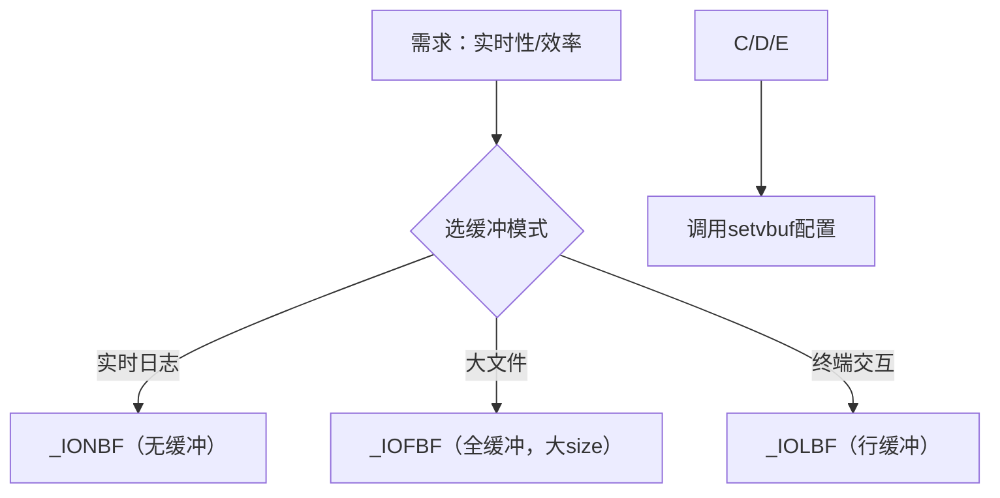
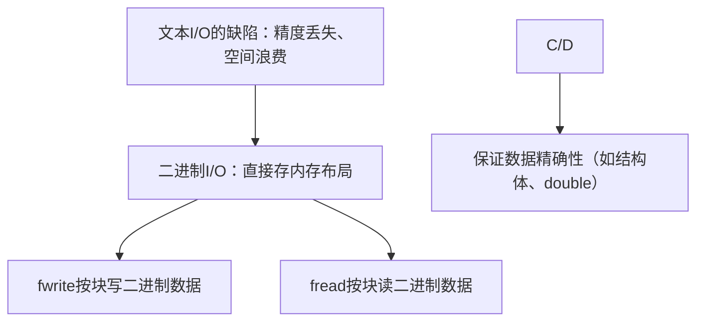
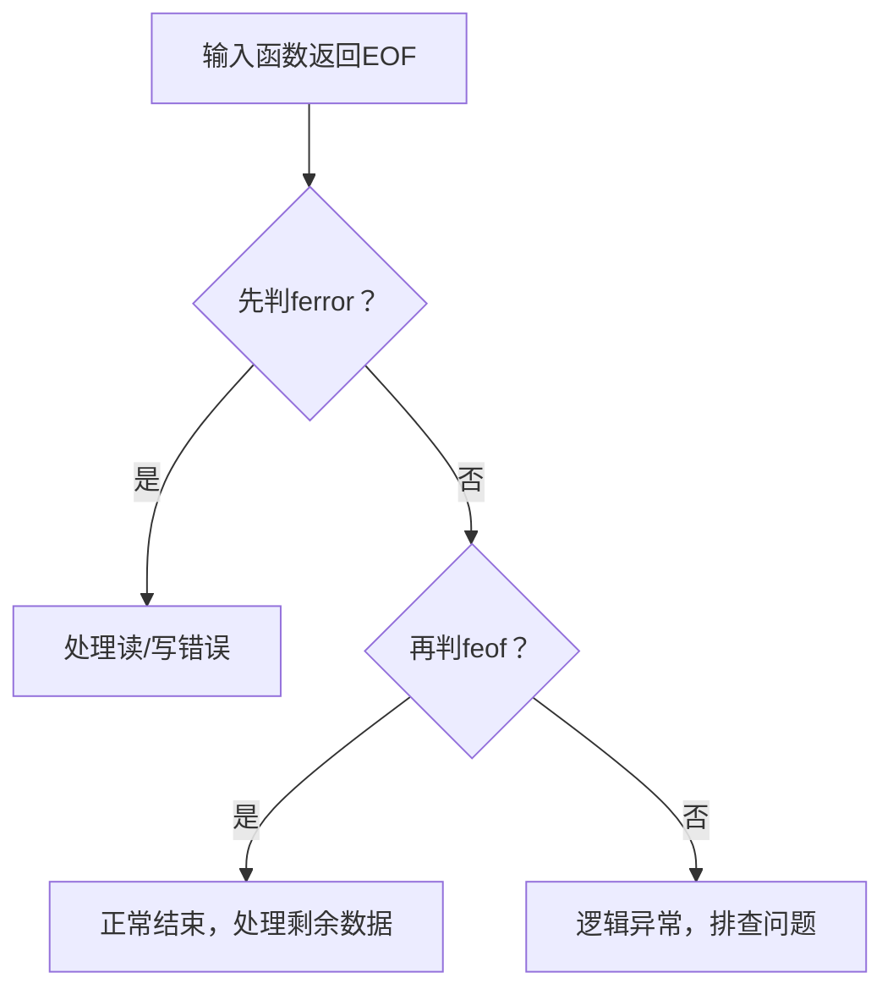

### 13.7.3~13.7.7 标准I/O函数深度解析  


### 一、核心知识总结（分节提炼）  
#### 1. `setvbuf`：定制缓冲区  
- **作用**：替代标准I/O默认缓冲，灵活控制读写性能。  
- **关键规则**：  
  - 必须在 `fopen` 后 **立即调用**（未对文件流操作前）。  
  - `mode` 可选：`_IOFBF`（全缓冲）、`_IOLBF`（行缓冲）、`_IONBF`（无缓冲）。  
  - 自定义 `buf` 时，需确保内存有效（如静态数组/堆内存）。  


#### 2. 二进制I/O（`fread`/`fwrite`）  
- **核心优势**：直接存储**内存二进制布局**，避免文本I/O的格式转换失真（如`double`精度丢失）。  
- **函数原型**：  
  ```c
  size_t fwrite(const void *ptr, size_t size, size_t nmemb, FILE *fp); // 写
  size_t fread(void *ptr, size_t size, size_t nmemb, FILE *fp);        // 读
  ```  
  - `size`：单个数据块大小（如`sizeof(int)`）；`nmemb`：数据块数量。  
  - 返回值：实际读写的块数（用于判断是否完整读写）。  


#### 3. `feof` & `ferror`：错误区分  
- **`feof(fp)`**：仅当**文件真正结束**时返回非0（需在读取操作后调用）。  
- **`ferror(fp)`**：当**读/写错误**（如磁盘故障）时返回非0。  
- **使用原则**：先判错误（`ferror`），再判结束（`feof`），避免逻辑颠倒。  


### 二、逻辑关系梳理（因果/递进）  
#### 1. 缓冲定制的决策链：  


#### 2. 二进制I/O的设计逻辑：  


#### 3. 错误处理的分层判断：  



### 三、编程举例与说明  
#### 示例1：`setvbuf` 优化大文件读取（全缓冲）  
```c
#include <stdio.h>
#define BUF_SIZE 4096 // 磁盘块大小，提升效率

int main() {
    FILE *fp = fopen("large.bin", "rb");
    if (fp == NULL) return 1;
    
    static char buf[BUF_SIZE]; // 静态数组，避免栈溢出
    // 配置全缓冲，4KB大小
    if (setvbuf(fp, buf, _IOFBF, BUF_SIZE) != 0) { 
        fprintf(stderr, "setvbuf failed!\n");
        return 1;
    }
    
    // 后续fread会利用大缓冲，减少IO次数
    double data[1000];
    fread(data, sizeof(double), 1000, fp); 
    fclose(fp);
    return 0;
}
```  
**说明**：  
- 全缓冲配合磁盘块大小，大幅提升大文件读取效率。  


#### 示例2：二进制存储数组（对比文本I/O的失真）  
```c
#include <stdio.h>
#include <math.h>

int main() {
    double pi = M_PI; // 高精度数值
    
    // 二进制写（精确存储）
    FILE *fp = fopen("pi.bin", "wb");
    fwrite(&pi, sizeof(double), 1, fp);
    fclose(fp);
    
    // 文本写（失真）
    fp = fopen("pi.txt", "w");
    fprintf(fp, "%f", pi); // 仅存6位小数，丢失精度
    fclose(fp);
    
    // 验证读取：二进制仍精确，文本已失真
    double pi_bin, pi_txt;
    fp = fopen("pi.bin", "rb"); fread(&pi_bin, sizeof(double), 1, fp); fclose(fp);
    fp = fopen("pi.txt", "r"); fscanf(fp, "%lf", &pi_txt); fclose(fp);
    
    printf("Binary: %.15f\n", pi_bin); // 完整精度：3.141592653589793
    printf("Text:    %.15f\n", pi_txt); // 失真：3.141592000000000
    return 0;
}
```  
**说明**：  
- 二进制I/O保留`double`全部精度，文本I/O因格式转换丢失细节。  


#### 示例3：正确使用`feof`和`ferror`  
```c
#include <stdio.h>

int main() {
    FILE *fp = fopen("data.txt", "r");
    if (fp == NULL) return 1;
    
    int ch;
    while ((ch = getc(fp)) != EOF) { 
        putchar(ch); // 正常读取
    }
    
    // 读取结束后判断原因
    if (ferror(fp)) {
        printf("\nRead error occurred!\n");
    } else if (feof(fp)) {
        printf("\nReached end of file.\n");
    }
    
    fclose(fp);
    return 0;
}
```  
**说明**：  
- 必须在**读取循环结束后**调用`feof`/`ferror`，避免提前判断导致逻辑错误。  


### 四、对比表格（关键概念）  
#### 1. 缓冲模式对比（`setvbuf`）  
| **模式**      | 宏定义      | 触发刷盘时机                | 内存消耗 | 典型场景          |  
|---------------|-------------|-----------------------------|----------|-------------------|  
| 全缓冲        | `_IOFBF`    | 缓冲满 / `fflush` / 关闭    | 高       | 大文件读写        |  
| 行缓冲        | `_IOLBF`    | 换行 / 缓冲满 / `fflush`    | 中       | 终端输出（`stdout`） |  
| 无缓冲        | `_IONBF`    | 立即刷盘                    | 低       | 错误日志（`stderr`） |  


#### 2. 文本I/O vs 二进制I/O（核心差异）  
| **维度**       | 文本I/O（如`fprintf`）         | 二进制I/O（`fread`/`fwrite`） |  
|----------------|--------------------------------|--------------------------------|  
| **数据形式**   | 字符串（人类可读）             | 内存二进制（程序可直接解析）   |  
| **精度**       | 丢失（如`double`转字符串）     | 完全精确（同内存布局）         |  
| **空间效率**   | 低（如`int`存为"123"占3字节）  | 高（`int`占4字节，与内存一致） |  
| **跨平台问题** | 无（字符串通用）               | 需处理字节序、结构体对齐       |  


### 五、扩展知识点补充  
#### 1. `setvbuf` 的隐藏陷阱  
- **缓冲区大小限制**：系统可能强制最小/最大值（如`size`设为1字节会被忽略，实际用默认值）。  
- **线程安全**：多线程下，自定义缓冲需加锁，避免竞争条件。  

#### 2. 二进制I/O的跨平台兼容  
- **字节序转换**：  
  ```c
  // 大端转小端（或反之）
  uint32_t htonl(uint32_t hostlong); // 网络字节序（大端）转换
  ```  
- **结构体对齐**：  
  ```c
  #pragma pack(1) // 强制1字节对齐，避免编译器自动填充
  typedef struct { ... } Data;
  #pragma pack()
  ```  

#### 3. `feof` 的经典误区  
- **错误用法**：在读取前调用`feof(fp)`，此时必然返回0（EOF标记未设置）。  
- **正确逻辑**：  
  ```c
  // 错误：先判feof，永远循环
  while (!feof(fp)) { fgetc(fp); } 
  
  // 正确：先读，再判EOF
  int ch;
  while ((ch = fgetc(fp)) != EOF) { ... }
  ```  


通过以上讲解，可系统掌握 **缓冲定制、二进制精确读写、错误区分** 的核心逻辑，结合代码和扩展知识，能解决实际开发中“性能优化”“数据精确性”“跨平台兼容”等关键问题。