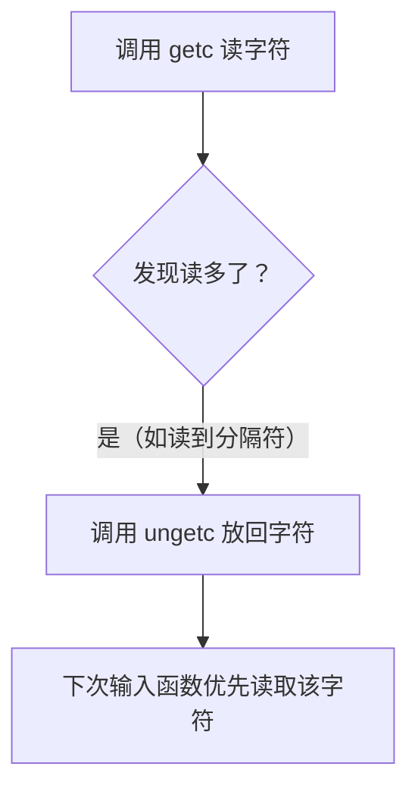
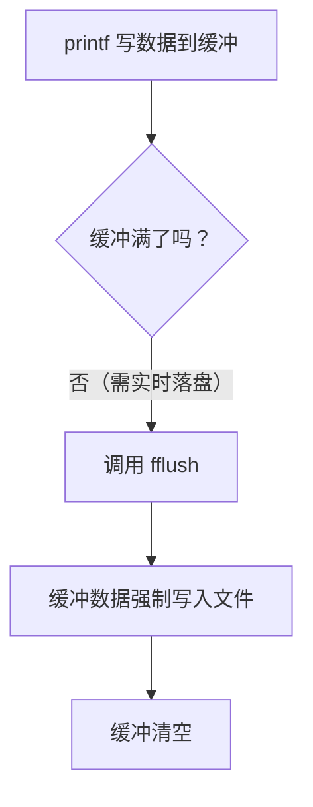

### 13.7 其他标准I/O函数核心讲解  


#### 一、核心知识总结（分点提炼）  
##### 1. `ungetc(int c, FILE *fp)` 函数  
- **功能**：将字符 `c` 「放回输入流」，下次调用输入函数（如 `getc`/`scanf`）时优先读取该字符。  
- **规则**：  
  - ANSI C 保证 **单次放回1个字符有效**（多字符放回需看系统实现，若支持则顺序**反转**）。  
  - 仅适用于 **输入流**（如读模式打开的文件），输出流调用无意义。  
- **场景**：解析数据时回退字符（如读取到分隔符后，将分隔符放回供后续处理）。  

##### 2. `fflush(FILE *fp)` 函数  
- **功能**：强制 **刷新输出缓冲区**，将缓冲中未写入文件的数据立即写入磁盘。  
- **规则**：  
  - `fp = NULL` 时，刷新 **所有输出流**（如 `stdout`/`stderr`/普通文件流）。  
  - **输入流慎用**：若最近操作是「读」，行为未定义（仅允许「非读操作后」调用，如写操作后）。  
- **场景**：实时日志、程序退出前确保数据落盘、交互输出即时显示。  


#### 二、逻辑关系梳理（流程拆解）  
##### 1. `ungetc` 工作流程（因果链）：  


##### 2. `fflush` 工作流程（因果链）：  



#### 三、编程举例与说明  
##### 示例1：`ungetc` 解析括号前内容（词法分析场景）  
```c
#include <stdio.h>
int main() {
    int ch;
    FILE *fp = fopen("test.txt", "r"); // 文件内容："abc(123)"
    if (fp == NULL) return 1;
    
    // 步骤1：读取到 '(' 为止
    while ((ch = getc(fp)) != '(') { 
        putchar(ch); // 输出：a b c 
    }
    
    // 步骤2：将 '(' 放回输入流
    ungetc(ch, fp); // 下次读会先取 '('
    
    // 步骤3：验证回退效果
    ch = getc(fp); 
    printf("\nRecovered: %c\n", ch); // 输出：( 
    
    fclose(fp);
    return 0;
}
```  
**说明**：  
- 通过 `ungetc` 回退分隔符 `(`，让后续逻辑可重新读取该字符，实现“解析回退”。  


##### 示例2：`fflush` 保证日志实时输出（防崩溃丢数据）  
```c
#include <stdio.h>
#include <time.h>
#include <unistd.h> // 含 sleep 函数

int main() {
    FILE *log = fopen("app.log", "w");
    for (int i = 0; i < 3; i++) {
        time_t now = time(NULL);
        fprintf(log, "Log %d: %s", i, ctime(&now)); 
        fflush(log); // 每次写后立即刷盘，避免程序崩溃时数据丢失
        sleep(1);    // 模拟耗时操作
    }
    fclose(log);
    return 0;
}
```  
**说明**：  
- 若不调用 `fflush`，`fprintf` 的数据会暂存缓冲区，程序崩溃时可能丢失；`fflush` 强制刷盘，保证日志实时性。  


#### 四、对比表格（`ungetc` vs `fflush`）  
| **维度**       | `ungetc(int c, FILE *fp)`          | `fflush(FILE *fp)`                |  
|----------------|------------------------------------|-----------------------------------|  
| **操作对象**   | 输入流（读模式的文件/标准输入）    | 输出流（写模式的文件/标准输出）；`NULL` 时刷所有输出流 |  
| **核心行为**   | 修改输入流的读取位置（回退字符）   | 强制清空输出缓冲，数据写入文件     |  
| **调用限制**   | 多字符回退依赖系统实现             | 输入流调用需确保最近操作不是读     |  
| **典型场景**   | 解析器回退分隔符（如词法分析）     | 实时日志、程序退出前数据落盘       |  


#### 五、扩展知识点补充  
##### 1. `ungetc` 的隐藏细节  
- **缓冲依赖**：放回的字符暂存于 **输入缓冲区**（而非文件），若缓冲已满，`ungetc` 会返回 `EOF`（失败）。  
- **与 `scanf` 协作**：`scanf` 会读取 `ungetc` 放回的字符（如 `ungetc('1', stdin)` 后，`scanf("%d", &x)` 会读 `1`）。  

##### 2. `fflush` 的缓冲类型影响  
| **缓冲类型** | `fflush` 效果                     | 示例对象          |  
|--------------|-----------------------------------|-------------------|  
| 全缓冲       | 强制刷盘（默认大文件，缓冲满才自动刷）| `fopen` 的普通文件 |  
| 行缓冲       | 刷盘并保留换行触发逻辑（如 `stdout`）| `stdout`          |  
| 无缓冲       | 本来就立即刷盘，调用无额外效果     | `stderr`          |  

##### 3. 进阶关联：线程安全与锁  
- 多线程下，`fflush` 需配合 `flockfile`/`funlockfile` 加锁，否则可能因**缓冲竞争**导致数据混乱。  


通过以上讲解，可清晰掌握 **`ungetc` 的“回退解析”能力**和 **`fflush` 的“强制落盘”机制**，结合代码和扩展知识，能更灵活应对输入解析、输出实时性等实际场景。