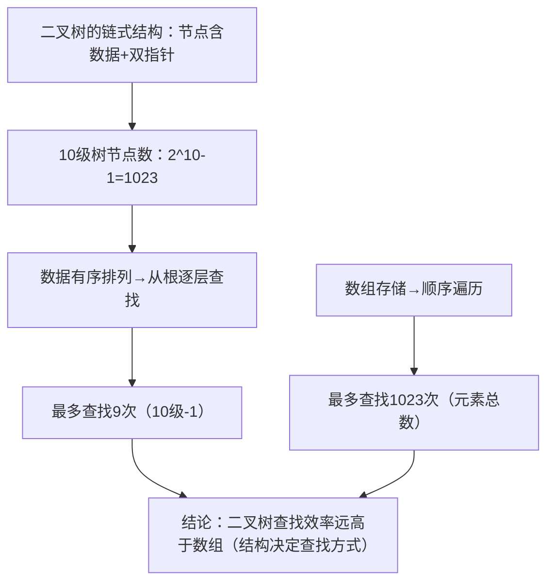

### 1. 主题总结：链式结构之二叉树的效率优势  
#### 核心知识要点（分点提炼）：  
1. **链式结构的二叉树定义**：  
   - 每个节点包含 **1个数据域** 和 **2个指针域**（指向左、右子节点），通过指针连接形成层级结构。  
2. **节点数计算**：  
   - n级二叉树的节点总数为 \(2^n - 1\)（如10级树：\(2^{10}-1=1023\) 个节点）。  
3. **查找效率对比（核心结论）**：  
   - **二叉树**：若数据有序排列（如左小右大），从根节点逐层查找，最坏需遍历 **“树的深度-1”次**（10级树最多9次，时间复杂度 \(O(\log_2 n)\)）。  
   - **数组**：需顺序遍历，最坏需遍历 **全部元素**（1023个元素查1023次，时间复杂度 \(O(n)\)）。  


### 2. 段落逻辑梳理（因果/递进关系）  



### 3. 编程知识点举例（C语言定义二叉树节点）  
```c
#include <stdio.h>

// 定义二叉树节点结构体：数据+左右子节点指针
typedef struct TreeNode {
    int data;               // 数据域：存储节点值
    struct TreeNode *left;  // 左子节点指针
    struct TreeNode *right; // 右子节点指针
} TreeNode;

int main() {
    // 构建简单二叉树（根节点+左右子节点）
    TreeNode root, leftNode, rightNode;
    
    // 根节点初始化
    root.data = 100;
    root.left = &leftNode;  // 根节点左指针指向左子节点
    root.right = &rightNode;// 根节点右指针指向右子节点
    
    // 左子节点初始化
    leftNode.data = 50;
    leftNode.left = NULL;   // 无左子树
    leftNode.right = NULL;  // 无右子树
    
    // 右子节点初始化
    rightNode.data = 150;
    rightNode.left = NULL;  
    rightNode.right = NULL;  
    
    // 遍历输出（验证结构）
    printf("根节点数据：%d\n", root.data);
    printf("左子节点数据：%d\n", root.left->data);
    printf("右子节点数据：%d\n", root.right->data);
    
    return 0;
}
```  
**代码说明**：  
- 通过 `struct` 定义二叉树节点，利用指针连接子节点，模拟层级结构。  
- 实际应用中，需结合递归/循环实现 **查找、插入、删除**（如根据 `data` 大小判断走左/右子树）。  


### 4. 对比表格（二叉树 vs 数组 查找效率）  
| **对比维度**       | 二叉树（有序，如查找树）       | 数组                         |
|--------------------|--------------------------------|------------------------------|
| 数据结构           | 链式层级，节点含指针           | 连续内存，顺序存储           |
| 查找方式           | 逐层定向（左/右子树判断）      | 顺序遍历（从首元素开始）     |
| 最坏查找次数       | 树深度-1（如10级树→9次）       | 元素总数（如1023个→1023次）  |
| 时间复杂度         | \(O(\log_2 n)\)（高效，对数级） | \(O(n)\)（低效，线性级）      |
| 典型适用场景       | 频繁查找、动态增删数据         | 频繁随机访问（通过下标）     |  


### 5. 扩展知识点（围绕二叉树）  
#### ① 二叉树分类：  
| 类型         | 特点                                   | 示例场景               |
|--------------|----------------------------------------|------------------------|
| 满二叉树     | 每层节点数达最大值（第k层有 \(2^{k-1}\) 个节点） | 完美层级结构           |
| 完全二叉树   | 除最后一层外节点全满，最后一层左连续       | 堆结构（优先队列）     |
| 二叉查找树（BST） | 左子树数据 < 根 < 右子树数据             | 高效查找系统           |  

#### ② 遍历方式（递归实现）：  
```c
// 前序遍历（根→左→右）
void preOrder(TreeNode *root) {
    if (root != NULL) {
        printf("%d ", root->data); // 访问根
        preOrder(root->left);      // 遍历左子树
        preOrder(root->right);     // 遍历右子树
    }
}
```  

#### ③ 延伸应用与概念：  
- **平衡二叉树**：如AVL树、红黑树，通过旋转保持平衡，避免退化成链表（保证 \(O(\log_2 n)\) 效率）。  
- **时间复杂度本质**：\(O(\log_2 n)\) 随数据量增长的“增速”远慢于 \(O(n)\)（如n=100万时，\(\log_2 n≈20\)，但n=100万）。  
- **链式结构共性**：灵活扩展（无需预分配内存），但需额外空间存储指针（空间换时间）。  


通过以上梳理，可清晰理解 **二叉树的结构优势、效率逻辑及扩展方向**，为后续数据结构学习奠定基础。