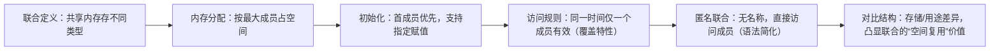

### 1. 主题总结：C语言联合（Union）核心知识  
#### 关键概念与核心结论：  
1. **定义本质**：  
   - 同一块内存空间**共享存储**，同一时间仅能保存**一种数据类型**（不同时存储多个成员的值）。  
2. **内存分配规则**：  
   - 联合的大小 = 其**最大成员的字节数**（如 `union { int a; double b; }` 占 8 字节，因 `double` 更大）。  
3. **初始化与赋值**：  
   - 传统方式：仅能初始化**第一个成员**；C99+ 支持 **指定初始化**（如 `union u = {.b = 3.14};`）。  
4. **访问约束**：  
   - 赋值某成员后，其他成员因内存覆盖**数据失效**（需通过状态标记区分当前有效成员）。  
5. **匿名联合（C11特性）**：  
   - 无名称的联合，可直接访问成员（常用于结构体内部，简化语法）。  


### 2. 段落逻辑梳理（递进关系）  



### 3. 编程知识点举例（联合的定义、使用与陷阱）  
```c
#include <stdio.h>

// 定义联合：复用内存存储 int、double、char
union Data {
    int int_val;    // 4字节
    double dbl_val; // 8字节（决定联合大小）
    char chr_val;   // 1字节
};

// 带状态标记的联合用法（避免访问错误成员）
struct TaggedUnion {
    union Data data;
    enum { TYPE_INT, TYPE_DOUBLE, TYPE_CHAR } type; // 标记当前有效类型
};

int main() {
    // 示例1：基础使用（体现覆盖特性）
    union Data u1;
    u1.int_val = 1024;          // 存int，占4字节
    printf("u1.int_val = %d\n", u1.int_val); // 输出：1024（有效）
    
    u1.dbl_val = 3.1415;        // 存double，覆盖int的内存
    printf("u1.dbl_val = %.4f\n", u1.dbl_val); // 输出：3.1415（有效）
    // printf("u1.int_val = %d\n", u1.int_val); // 危险！内存被double覆盖，值无意义
    
    // 示例2：带状态标记的联合（安全访问）
    struct TaggedUnion tu;
    tu.type = TYPE_DOUBLE;      // 标记为double类型
    tu.data.dbl_val = 6.28;     
    if (tu.type == TYPE_DOUBLE) {
        printf("Valid: %.2f\n", tu.data.dbl_val); // 输出：6.28（安全访问）
    }
    
    // 示例3：匿名联合（C11）
    struct Device {
        char name[20];
        union { // 匿名联合，直接访问成员
            int id;
            char uuid[36];
        };
    } dev = {"Sensor"};
    
    dev.id = 1001;              // 存int
    printf("Device ID: %d\n", dev.id); // 输出：1001
    
    dev.uuid[0] = 'U';          // 存char数组，覆盖id的内存
    dev.uuid[1] = '\0';        
    printf("Device UUID: %s\n", dev.uuid); // 输出：U
    
    return 0;
}
```  
**代码说明**：  
- **覆盖特性**：`union Data` 占 8 字节（因 `double` 最大），赋值 `dbl_val` 会覆盖 `int_val` 的内存。  
- **安全访问**：通过 `enum` 标记当前有效成员（`TaggedUnion`），避免未定义行为。  
- **匿名联合**：结构体 `Device` 中直接用 `.id` 或 `.uuid` 访问，无需联合名称，简化语法。  


### 4. 对比表格：联合（Union） vs 结构（Struct）  
| **对比维度**       | 联合（Union）                          | 结构（Struct）                        |
|--------------------|----------------------------------------|----------------------------------------|
| **内存分配**       | 共享内存，大小=最大成员字节数          | 成员内存累加，大小=各成员字节数之和     |
| **存储能力**       | 同一时间存 **1种** 成员的值            | 同时存 **所有** 成员的值                |
| **初始化规则**     | 仅首成员默认初始化（或指定成员）       | 可按顺序/指定初始化所有成员             |
| **典型场景**       | 空间敏感场景（如协议解析、硬件寄存器）  | 数据聚合场景（如用户信息：姓名+年龄+性别）|
| **访问风险**       | 误访问未激活成员会导致未定义行为        | 成员独立，无覆盖风险                    |  


### 5. 扩展知识点（联合的延伸应用与避坑）  
#### ① 高级应用场景：  
- **类型擦除**：在泛型编程中，用联合存储不同类型（如 `JSON` 解析中，值可能是 `int`/`double`/`string`）。  
- **位段与联合结合**：解析硬件寄存器的位域（如 `union { int val; struct { int flag:1; ... } bits; }`），同时支持整数值和位操作。  

#### ② 编译器细节：  
- **内存对齐**：联合的对齐规则与最大成员一致（如 `double` 对齐到 8 字节，联合也对齐到 8 字节），需注意跨平台差异。  
- **空联合（C11禁止）**：早期GCC支持空联合，C11标准要求联合至少有一个成员。  

#### ③ 避坑指南：  
- **禁止依赖内存覆盖的副作用**：如通过 `char` 成员“窥探”其他类型的位模式（不同平台字节序可能不同，导致结果不可靠）。  
- **线程安全**：联合的共享内存特性在多线程中需加锁，避免并发访问冲突。  


通过以上分析，可深入理解 **联合的“空间复用”核心机制**、与结构的本质差异，以及实际开发中的安全用法和陷阱，为处理复杂数据场景提供技术支撑。