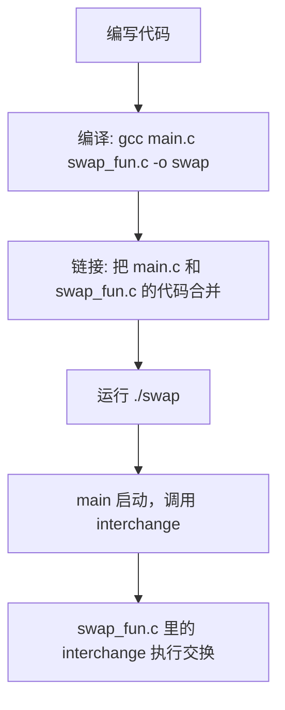

测试验证同单文件指针示例，重点观察：
修改 swap_fun.c 中函数逻辑（如添加打印 ），重新编译后功能是否变化，验证多文件编译的 “修改模块不影响其他文件，只需重新编译对应模块”。
故意删除 swap_fun.h 中函数声明，观察 main.c 编译报错，理解头文件是多文件协作的 “接口”，必须正确声明函数。
总结
单文件示例：清晰展示值传递的局限性和指针（地址传递 ）的解决思路，适合初学者理解参数传递的本质。
多文件拆分：模拟实际项目的模块化开发，通过头文件和多文件编译，让初学者掌握大型项目的代码组织方式。
测试方案：从基础功能验证到易错点（空指针、指针赋值 vs 解引用 ），逐步引导理解指针和多文件开发的核心知识，避免常见错误。

以下从 **值传递问题（`swap1.c`）**、**指针解决交换（`swap2.c`）**、**多文件拆分** 三个场景，梳理代码运行时的逻辑和功能实现，用简单流程图 + 关键步骤说明，帮你快速理解：

---

### 一、值传递问题（`swap1.c`）  
**核心逻辑**：演示「值传递无法让函数修改实参」的问题  

#### 运行流程：  
```mermaid
graph TD
    A[main 启动] --> B[定义 x=5, y=10]
    B --> C[打印 x=5, y=10]
    C --> D[调用 interchange(x, y)]
    D --> E[interchange 接收 x,y 的值，存到 u=5, v=10]
    E --> F[交换 u 和 v（u=10, v=5）]
    F --> G[打印 u=10, v=5]
    G --> H[回到 main]
    H --> I[打印 x=5, y=10（x,y 未变）]
```

#### 功能实现说明：  
- **值传递特点**：`interchange` 的形参 `u,v` 是 `x,y` 的「拷贝」，内存独立。  
  - 交换 `u,v` 只改拷贝的值，不影响 `main` 里的 `x,y`。  
- **结果**：函数内交换成功，但无法反馈给 `main`，实参 `x,y` 不变。  


---

### 二、指针解决交换（`swap2.c`）  
**核心逻辑**：用「指针传递地址」，让函数能修改实参  

#### 运行流程：  
```mermaid
graph TD
    A[main 启动] --> B[定义 x=5, y=10]
    B --> C[打印 x=5, y=10]
    C --> D[调用 interchange(&x, &y)]
    D --> E[interchange 接收 x,y 的地址，存到指针 u=&x, v=&y]
    E --> F[通过 *u（x的值）、*v（y的值）交换]
    F --> G[打印 *u=10, *v=5（直接改x,y的值）]
    G --> H[回到 main]
    H --> I[打印 x=10, y=5（x,y 已被修改）]
```

#### 功能实现说明：  
- **指针与地址传递**：  
  - `u` 存 `x` 的地址（`&x`），`v` 存 `y` 的地址（`&y`）。  
  - `*u` 表示「访问 `u` 指向的变量（即 `x`）」，修改 `*u` 会直接改 `x` 的值。  
- **结果**：函数内通过指针操作，真正交换了 `main` 里的 `x` 和 `y`。  


---

### 三、多文件拆分（拆分指针交换示例）  
**核心逻辑**：演示「代码模块化」，把函数定义拆分到单独文件，用头文件共享接口  

#### 文件分工：  
| 文件       | 作用                          | 关键内容                     |
|------------|-------------------------------|------------------------------|
| `main.c`   | 主逻辑                        | 调用 `interchange`，含 `main` |
| `swap_fun.c` | 函数实现                      | 定义 `interchange` 逻辑       |
| `swap_fun.h` | 头文件                        | 声明 `interchange` 原型       |

#### 运行流程（编译 + 运行）：  


#### 功能实现说明：  
- **头文件作用**：  
  - `swap_fun.h` 声明 `interchange` 原型，让 `main.c` 能「看到」函数，避免重复定义。  
- **模块化优势**：  
  - 改 `swap_fun.c` 的函数逻辑，只需重新编译该文件，不影响 `main.c`；适合多人协作、复杂项目。  


---

### 四、关键对比（值传递 vs 指针传递）  
| 场景          | 能否修改实参？        | 核心原因                     | 代码体现                 |
|---------------|-----------------------|------------------------------|--------------------------|
| 值传递（`swap1`） | ❌ 无法修改           | 形参是实参的「拷贝」，内存独立 | `interchange(x, y)`      |
| 指针传递（`swap2`） | ✅ 可以修改           | 形参存实参的「地址」，共享内存 | `interchange(&x, &y)`    |  


---

### 五、快速验证建议  
1. **值传递问题**：  
   - 运行 `swap1.c`，观察 `x,y` 交换前后值不变，理解「值传递的局限性」。  

2. **指针解决交换**：  
   - 运行 `swap2.c`，观察 `x,y` 被交换，理解「指针如何突破值传递限制」。  

3. **多文件拆分**：  
   - 按 `main.c` + `swap_fun.c` + `swap_fun.h` 创建文件，用 `gcc` 编译运行，感受「模块化开发」。  


通过这三个场景的流程梳理，能清晰看到：  
- 「值传递」的本质是**拷贝值**，无法反馈修改；  
- 「指针传递」的本质是**传地址**，能让函数直接操作实参内存；  
- 「多文件拆分」是**代码模块化**的基础，适合大型项目。  

如果有具体代码行看不懂，或想深入某个细节，可以直接说！